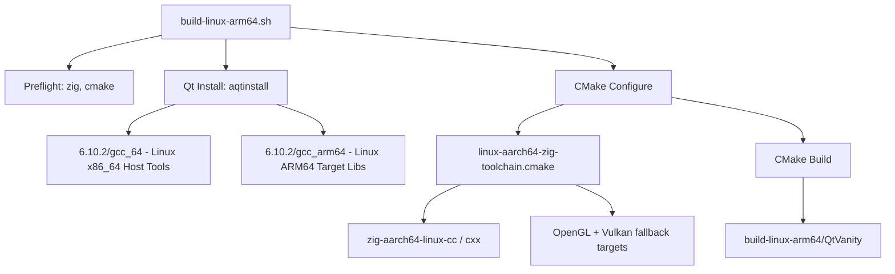

# Design Document: Linux aarch64 (ARM64) Cross-Compilation

## Overview

This feature adds cross-compilation support for targeting Linux aarch64 (ARM64) from a Linux x86_64 host, following the established pattern from the macOS aarch64 and Windows x86_64 cross-compilation setups. The approach uses Zig as a drop-in C/C++ cross-compiler, dual Qt 6.10.2 installations (Linux x86_64 host tools + Linux ARM64 target libraries), and a CMake toolchain file to orchestrate the build.

Unlike the Windows and macOS targets, Linux-to-Linux cross-compilation shares the same OS and binary format (ELF), but differs in CPU architecture. This means `CMAKE_SYSTEM_NAME` stays `Linux`, so all existing Linux-specific CMakeLists.txt sections (GNUInstallDirs, CPack DEB/TGZ, desktop file, icon installation) activate correctly without modification.

### Key Design Decisions

1. **Zig as cross-compiler**: Zig bundles a Clang/LLVM toolchain that can target `aarch64-linux-gnu` out of the box, eliminating the need for a separate cross-compilation toolchain (e.g., `aarch64-linux-gnu-gcc`). This mirrors the macOS and Windows approaches.
2. **Host system include path filtering**: Unlike the macOS wrappers (which handle framework paths) and the Windows wrappers (which filter host includes to avoid libc conflicts), the Linux ARM64 wrappers must filter host x86_64 system include paths (`/usr/include`, `/usr/local/include`, `/usr/lib/gcc/`) to prevent host headers from contaminating the aarch64 build. This follows the same pattern as the Windows wrappers.
3. **OpenGL resolved via `-lGL`**: Linux Qt links against `libGL.so`. The toolchain must provide a fallback `OpenGL::GL` target pointing to `-lGL` when `FindOpenGL` fails during cross-compilation (since the host's OpenGL is x86_64, not aarch64).
4. **Vulkan header stub**: Like the Windows cross-compile, a `Vulkan::Headers` stub with an empty include path prevents CMake from finding host x86_64 Vulkan headers.
5. **`CMAKE_SYSTEM_NAME=Linux`**: Since the target is also Linux, the existing CMakeLists.txt Linux paths activate naturally. `CMAKE_SYSTEM_PROCESSOR=aarch64` ensures CPack sets the correct Debian architecture (`arm64`).
6. **Qt `linux_arm64` archive**: aqtinstall provides a `linux_arm64` archive that installs to `gcc_arm64/`. The build script must handle this directory name and potential variants.

## Architecture

The cross-compilation pipeline follows the same three-layer architecture as the macOS and Windows builds:



### Data Flow

1. **Build script** verifies prerequisites (zig, cmake), downloads Qt if needed, resolves path mismatches
2. **CMake** loads the toolchain file, which sets `CMAKE_SYSTEM_NAME=Linux`, `CMAKE_SYSTEM_PROCESSOR=aarch64`, and points compilers at the Zig wrappers
3. **Zig wrappers** receive compiler invocations from CMake, strip incompatible `--target` flags and host system include paths, and forward to `zig cc`/`zig c++` with `-target aarch64-linux-gnu`
4. **Toolchain prereqs** (via `CMAKE_PROJECT_INCLUDE`) create `OpenGL::GL`, `WrapOpenGL::WrapOpenGL`, `Vulkan::Headers`, and `WrapVulkanHeaders::WrapVulkanHeaders` imported targets so Qt6Gui's dependencies resolve without host system paths
5. **CMake** finds Qt6 packages from the ARM64 prefix path, uses Linux x86_64 host tools for moc/rcc/uic, and produces a Linux ARM64 ELF binary `QtVanity`

## Components and Interfaces

### 1. Zig Compiler Wrappers

**Files**: `cmake/zig-aarch64-linux-cc`, `cmake/zig-aarch64-linux-cxx`

**Interface**: Invoked by CMake as `CMAKE_C_COMPILER` / `CMAKE_CXX_COMPILER`. Accept all standard compiler flags, with the following filtering:
- Filter out `--target=*` and `-target <arg>` (Zig handles targeting internally)
- Filter out host system include paths: `-isystem /usr/include*`, `-I /usr/include*`, `-isystem /usr/local/include*`, `-I /usr/local/include*`, `-isystem /usr/lib/gcc/*`, `-I /usr/lib/gcc/*` (both space-separated and concatenated forms)
- Forward everything else to `zig cc -target aarch64-linux-gnu` / `zig c++ -target aarch64-linux-gnu`

This follows the same pattern as the Windows wrappers (`cmake/zig-x86_64-windows-cc`), which also filter host includes. Unlike the macOS wrappers, no framework path conversion is needed.

### 2. CMake Toolchain File

**File**: `cmake/linux-aarch64-zig-toolchain.cmake`

**Responsibilities**:
- Set `CMAKE_SYSTEM_NAME=Linux`, `CMAKE_SYSTEM_PROCESSOR=aarch64`
- Point compilers at Zig wrappers
- Unset `CMAKE_C_COMPILER_TARGET` / `CMAKE_CXX_COMPILER_TARGET`
- Set `CMAKE_CROSSCOMPILING=TRUE`, `CMAKE_TRY_COMPILE_TARGET_TYPE=STATIC_LIBRARY`
- Set `CMAKE_FIND_ROOT_PATH_MODE_*` for cross-compilation search paths
- Include the prereqs file via `CMAKE_PROJECT_INCLUDE`

Unlike the Windows toolchain, no `CMAKE_EXECUTABLE_SUFFIX` or `WIN32` settings are needed. Unlike the macOS toolchain, no framework search or rpath settings are needed. This is the simplest of the three toolchain files.

### 3. Linux ARM64 Cross-Compile Prerequisites

**File**: `cmake/linux-aarch64-cross-prereqs.cmake`

**Responsibilities**:
- Create `OpenGL::GL` imported target pointing to `-lGL`
- Create `WrapOpenGL::WrapOpenGL` imported target
- Create `Vulkan::Headers` imported target with empty include path
- Create `WrapVulkanHeaders::WrapVulkanHeaders` imported target
- Set corresponding `*_FOUND` cache variables
- Guard all target creation with `if(NOT TARGET ...)` to avoid duplicates

This mirrors `cmake/windows-cross-prereqs.cmake` closely, with `-lGL` instead of `-lopengl32`.

### 4. Build Script

**File**: `build-linux-arm64.sh`

**Structure**: Follows the same pattern as `build-windows-x64.sh` and `build-macos-arm64.sh`:
1. Preflight checks (zig, cmake)
2. Download Linux ARM64 Qt target libraries if missing (aqtinstall `linux_arm64`)
3. Download Linux x86_64 Qt host tools if missing (aqtinstall `linux_gcc_64`)
4. Handle aqtinstall nested directory structure
5. Resolve Qt directory name variants for the ARM64 archive
6. Verify host moc exists
7. CMake configure with toolchain file
8. CMake build
9. Report output path

**Key difference from other build scripts**: The output is a Linux ELF binary (`QtVanity`) not a `.exe` or `.app` bundle.

### 5. Documentation

**File**: `CROSS_COMPILE_LINUX_ARM64.md`

**Structure**: Mirrors `CROSS_COMPILE_WINDOWS.md` and `CROSS_COMPILE_MACOS.md`:
- Prerequisites table (Zig, CMake, aqtinstall)
- Quick start section
- Architecture explanation (Zig cross-compiler, dual Qt, toolchain approach)
- File layout
- Manual build steps
- Troubleshooting (missing tools, path issues, host header contamination, linker errors)
- Limitations (no runtime testing on x86_64 host, OpenGL/Vulkan resolved at runtime)

## Data Models

This feature doesn't introduce runtime data models. The "data" is the build configuration:

### Qt Installation Layout

```
6.10.2/
├── gcc_64/                  # Linux x86_64 host tools (shared with other cross-compiles)
│   ├── bin/moc
│   ├── libexec/moc          # Qt 6.10.2 may place moc here
│   └── lib/cmake/
└── gcc_arm64/               # Linux ARM64 target libraries (from linux_arm64)
    ├── bin/
    ├── lib/
    │   ├── cmake/Qt6/
    │   ├── libQt6Core.so
    │   └── ...
    └── include/
```

### Cross-Compilation File Layout

```
cmake/
├── linux-aarch64-zig-toolchain.cmake    # CMake toolchain file
├── linux-aarch64-cross-prereqs.cmake    # OpenGL + Vulkan fallback for cross-compile
├── zig-aarch64-linux-cc                 # Zig C wrapper
└── zig-aarch64-linux-cxx               # Zig C++ wrapper

build-linux-arm64.sh                     # Automated build script
CROSS_COMPILE_LINUX_ARM64.md             # Documentation
```

### Build Script Configuration Variables

| Variable | Value | Description |
|----------|-------|-------------|
| `ARM64_QT_DIR` | `6.10.2/gcc_arm64` | Linux ARM64 Qt target libraries |
| `LINUX_QT_DIR` | `6.10.2/gcc_64` | Linux x86_64 Qt host tools |
| `TOOLCHAIN_FILE` | `cmake/linux-aarch64-zig-toolchain.cmake` | CMake toolchain |
| `BUILD_DIR` | `build-linux-arm64` | Build output directory |

### Directory Name Variants (aqtinstall)

| Archive ID | Expected dir | Potential variants | Nested path |
|------------|-------------|-------------------|-------------|
| `linux_arm64` | `gcc_arm64` | `gcc_arm64`, `linux_gcc_arm64` | `6.10.2/6.10.2/gcc_arm64` |
| `linux_gcc_64` | `gcc_64` | `gcc_64` | `6.10.2/6.10.2/gcc_64` |


## Correctness Properties

*A property is a characteristic or behavior that should hold true across all valid executions of a system — essentially, a formal statement about what the system should do. Properties serve as the bridge between human-readable specifications and machine-verifiable correctness guarantees.*

### Property 1: Argument filtering preserves non-target, non-host-include arguments

From the prework, criteria 1.3 and 1.4 both deal with filtering arguments passed through the Zig wrapper. 1.3 requires filtering `--target=*` and `-target <value>` flags, while 1.4 requires filtering host system include paths (`/usr/include*`, `/usr/local/include*`, `/usr/lib/gcc/*`). These are both aspects of the same argument filtering logic and can be validated by a single property: generate random argument lists containing a mix of target flags, host system include paths, and normal compiler flags, pass them through the wrapper, and verify that target flags and host include paths are absent while all other arguments appear in their original order.

*For any* list of compiler arguments, when passed through the Zig wrapper scripts, all `--target=*` and `-target <value>` flags and all host system include paths (`-isystem /usr/include*`, `-I /usr/include*`, `-isystem /usr/local/include*`, `-I /usr/local/include*`, `-isystem /usr/lib/gcc/*`, `-I /usr/lib/gcc/*`) should be removed, and all remaining arguments should appear in the output in their original order.

**Validates: Requirements 1.3, 1.4**

### Property 2: Missing tool detection

From the prework, criteria 4.1, 4.2, 4.6, and 4.7 all deal with the build script detecting missing required tools and failing with descriptive errors. These combine into a single property over the finite set {zig, cmake, moc}: for each tool, if it is absent, the script must exit non-zero and print an error containing the tool name.

*For any* required tool in the set {zig, cmake, moc}, if that tool is not available (not in PATH or not at the expected location), the build script should exit with a non-zero status and print an error message containing the name of the missing tool.

**Validates: Requirements 4.1, 4.2, 4.6, 4.7**

### Property 3: Qt directory name variant resolution

From the prework, criterion 5.2 requires the build script to handle known directory name variants for the aqtinstall `linux_arm64` archive. This is a small finite set of known variants (e.g., `gcc_arm64`, `linux_gcc_arm64`). For each variant, creating a directory structure with that name and running the resolution logic should find a valid Qt path containing `lib/cmake/Qt6`.

*For any* known aqtinstall directory name variant for the `linux_arm64` archive (e.g., `gcc_arm64`, `linux_gcc_arm64`), the build script should resolve to a valid Linux ARM64 Qt path that contains `lib/cmake/Qt6`.

**Validates: Requirements 5.1, 5.2, 5.3**

## Error Handling

### Build Script Errors

| Error Condition | Behavior | Exit Code |
|----------------|----------|-----------|
| `zig` not in PATH | Print "ERROR: zig not found in PATH" | 1 |
| `cmake` not in PATH | Print "ERROR: cmake not found in PATH" | 1 |
| `aqt` not in PATH (when Qt download needed) | Print "ERROR: aqtinstall not found" | 1 |
| `moc` not found in Linux x86_64 Qt | Print "ERROR: Cannot find moc in Linux Qt installation" | 1 |
| ARM64 Qt dir not found after download + variant check | Print "ERROR: Cannot find Linux ARM64 Qt libraries" | 1 |
| CMake configure fails | Propagated by `set -euo pipefail` | Non-zero |
| CMake build fails | Propagated by `set -euo pipefail` | Non-zero |

### Toolchain Errors

| Error Condition | Behavior |
|----------------|----------|
| OpenGL not found by FindOpenGL | `linux-aarch64-cross-prereqs.cmake` creates fallback `OpenGL::GL` target with `-lGL` |
| Vulkan headers not found | `linux-aarch64-cross-prereqs.cmake` creates stub `Vulkan::Headers` with empty include path |
| `qt_generate_deploy_app_script` on cross-compile | `NO_UNSUPPORTED_PLATFORM_ERROR` flag in CMakeLists.txt prevents failure |
| CMake injects `--target` flags | Zig wrappers filter them out silently |
| CMake injects host system include paths | Zig wrappers filter them out silently |

### Zig Wrapper Errors

The wrappers use `exec` to replace the shell process with zig, so zig's own exit code propagates directly to CMake. No additional error handling is needed in the wrappers — if zig fails to compile, CMake sees the non-zero exit and reports the error.

## Testing Strategy

### Dual Testing Approach

This feature involves shell scripts, CMake files, and build integration. Testing is split into:

1. **Unit tests (examples)**: Verify specific file contents, static properties of toolchain/wrapper scripts, and documentation completeness
2. **Property tests**: Verify universal properties of the flag filtering logic and path resolution

### Property-Based Testing

**Library**: [Hypothesis](https://hypothesis.readthedocs.io/) (Python), consistent with the existing tests in `tests/cross-compile/`.

Since the artifacts under test are shell scripts and CMake files (not C++ code), property-based testing targets the script logic:

- **Property 1 (argument filtering)**: Generate random argument lists containing a mix of `--target=<value>`, `-target <value>`, host system include paths (`-isystem /usr/include`, `-I /usr/local/include`, etc.), and normal compiler flags. Pass them through the wrapper (with zig replaced by a mock that echoes args). Verify target flags and host include paths are absent and all other args are present in order. Minimum 100 iterations.
  - Tag: `Feature: linux-arm64-cross-compile, Property 1: Argument filtering preserves non-target, non-host-include arguments`

- **Property 2 (missing tool detection)**: For each tool in {zig, cmake, moc}, run the build script in an environment where that tool is absent. Verify non-zero exit and error message. This is a small finite set, so exhaustive example testing covers it.
  - Tag: `Feature: linux-arm64-cross-compile, Property 2: Missing tool detection`

- **Property 3 (Qt directory variant resolution)**: Create directory structures with each known variant name, run the resolution logic, verify it finds the correct path. Small finite set — exhaustive example testing.
  - Tag: `Feature: linux-arm64-cross-compile, Property 3: Qt directory name variant resolution`

### Unit Tests (Examples)

| Test | What it verifies |
|------|-----------------|
| Wrapper scripts exist and are executable | Req 1.5 |
| Wrapper CC invokes `zig cc -target aarch64-linux-gnu` | Req 1.1 |
| Wrapper CXX invokes `zig c++ -target aarch64-linux-gnu` | Req 1.2 |
| Toolchain sets CMAKE_SYSTEM_NAME=Linux | Req 2.1, 7.1 |
| Toolchain sets CMAKE_SYSTEM_PROCESSOR=aarch64 | Req 2.1 |
| Toolchain unsets compiler target variables | Req 2.3 |
| Toolchain sets CMAKE_CROSSCOMPILING=TRUE | Req 2.4 |
| Toolchain sets CMAKE_PROJECT_INCLUDE to prereqs file | Req 2.6 |
| Prereqs file creates OpenGL::GL target with `-lGL` | Req 3.1 |
| Prereqs file creates WrapOpenGL::WrapOpenGL target | Req 3.2 |
| Prereqs file creates Vulkan::Headers target with empty include | Req 3.3 |
| Prereqs file creates WrapVulkanHeaders::WrapVulkanHeaders target | Req 3.4 |
| Prereqs file guards all targets with if(NOT TARGET) | Req 3.5 |
| Build script uses correct cmake flags | Req 4.8, 4.9 |
| CMakeLists.txt maps aarch64 to arm64 for CPACK_DEBIAN_PACKAGE_ARCHITECTURE | Req 7.2 |
| CMakeLists.txt includes NO_UNSUPPORTED_PLATFORM_ERROR | Req 7.3 |
| Documentation contains prerequisites table | Req 6.1 |
| Documentation contains quick-start section | Req 6.2 |
| Documentation contains architecture explanation | Req 6.3 |
| Documentation contains file layout | Req 6.4 |
| Documentation contains manual build steps | Req 6.5 |
| Documentation contains troubleshooting section | Req 6.6 |
| Documentation contains limitations section | Req 6.7 |

### Test Configuration

- Property tests: minimum 100 iterations per property
- Each property test must reference its design document property via comment tag
- Tag format: `Feature: linux-arm64-cross-compile, Property {number}: {property_text}`
- Each correctness property is implemented by a single property-based test
