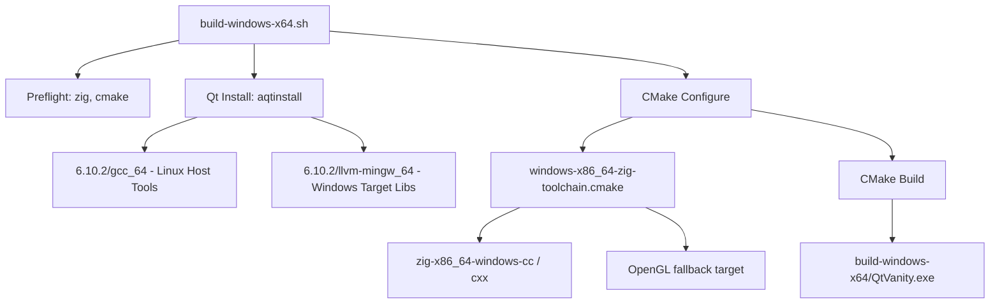

# Design Document: Windows x86_64 Cross-Compilation

## Overview

This feature adds cross-compilation support for targeting Windows x86_64 from a Linux host, following the established pattern from the macOS aarch64 cross-compilation. The approach uses Zig as a drop-in C/C++ cross-compiler, dual Qt 6.10.2 installations (Linux host tools + Windows target libraries), and a CMake toolchain file to orchestrate the build.

Several artifacts already exist in the repository in partial or draft form (Zig wrappers, toolchain file, build script). This design addresses completing, correcting, and documenting them so the full pipeline works end-to-end.

### Key Design Decisions

1. **Zig as cross-compiler**: Zig bundles a Clang/LLVM toolchain that can target `x86_64-windows-gnu` out of the box, eliminating the need for a separate MinGW installation. This mirrors the macOS approach.
2. **Simpler wrappers than macOS**: The Windows Zig wrappers only need to filter `--target`/`-target` flags. Unlike macOS, there are no framework path conversions needed.
3. **OpenGL resolved via `opengl32` import library**: Windows Qt links against `opengl32.dll` (not a framework). The toolchain must provide a fallback `OpenGL::GL` target pointing to `-lopengl32` when `FindOpenGL` fails during cross-compilation.
4. **Path mismatch handling**: aqtinstall produces `llvm-mingw_64` (with hyphen) for the `win64_llvm_mingw` archive, but the existing build script references `llvm_mingw` (with underscore). The build script must check for known directory name variants.

## Architecture

The cross-compilation pipeline follows the same three-layer architecture as the macOS build:



### Data Flow

1. **Build script** verifies prerequisites, downloads Qt if needed, resolves path mismatches
2. **CMake** loads the toolchain file, which sets `CMAKE_SYSTEM_NAME=Windows` and points compilers at the Zig wrappers
3. **Zig wrappers** receive compiler invocations from CMake, strip incompatible `--target` flags, and forward to `zig cc`/`zig c++` with `-target x86_64-windows-gnu`
4. **Toolchain prereqs** (via `CMAKE_PROJECT_INCLUDE`) create an `OpenGL::GL` imported target so Qt6Gui's `WrapOpenGL` dependency resolves
5. **CMake** finds Qt6 packages from the Windows prefix path, uses Linux host tools for moc/rcc/uic, and produces `QtVanity.exe`

## Components and Interfaces

### 1. Zig Compiler Wrappers

**Files**: `cmake/zig-x86_64-windows-cc`, `cmake/zig-x86_64-windows-cxx`

**Status**: Already exist and are correct.

**Interface**: Invoked by CMake as `CMAKE_C_COMPILER` / `CMAKE_CXX_COMPILER`. Accept all standard compiler flags, filter out `--target=*` and `-target <arg>`, forward everything else to `zig cc -target x86_64-windows-gnu` / `zig c++ -target x86_64-windows-gnu`.

Unlike the macOS wrappers, no framework path conversion is needed since Windows doesn't use the framework linking model.

### 2. CMake Toolchain File

**File**: `cmake/windows-x86_64-zig-toolchain.cmake`

**Status**: Exists but needs a `CMAKE_PROJECT_INCLUDE` for OpenGL resolution.

**Responsibilities**:
- Set `CMAKE_SYSTEM_NAME=Windows`, `CMAKE_SYSTEM_PROCESSOR=AMD64`
- Point compilers at Zig wrappers
- Unset `CMAKE_C_COMPILER_TARGET` / `CMAKE_CXX_COMPILER_TARGET`
- Set `CMAKE_EXECUTABLE_SUFFIX=.exe`
- Set `CMAKE_CROSSCOMPILING=TRUE`, `CMAKE_TRY_COMPILE_TARGET_TYPE=STATIC_LIBRARY`
- Configure Windows library naming (`.dll`, `.dll.a`, `.a`)
- Set `CMAKE_FIND_ROOT_PATH_MODE_*` for cross-compilation search paths
- Include a prereqs file via `CMAKE_PROJECT_INCLUDE` for OpenGL fallback

### 3. Windows Cross-Compile Prerequisites

**File**: `cmake/windows-cross-prereqs.cmake` (new)

**Responsibilities**:
- Create `OpenGL::GL` imported target pointing to `-lopengl32`
- Create `WrapOpenGL::WrapOpenGL` imported target
- Set `OPENGL_FOUND`, `OpenGL_FOUND` cache variables

This mirrors `cmake/macos-cross-prereqs.cmake` but is simpler — no @rpath fixes needed, just the OpenGL target.

### 4. Build Script

**File**: `build-windows-x64.sh`

**Status**: Exists but has a path mismatch bug (`llvm_mingw` vs `llvm-mingw_64`).

**Changes needed**:
- Check for both `llvm-mingw_64` (actual aqtinstall output) and `llvm_mingw` (legacy name)
- Handle the aqtinstall nested directory for `llvm-mingw_64`
- Print the resolved Windows Qt path for diagnostics

### 5. Documentation

**File**: `CROSS_COMPILE_WINDOWS.md` (new)

**Structure**: Mirrors `CROSS_COMPILE_MACOS.md` — prerequisites table, quick start, architecture explanation, file layout, manual build steps, troubleshooting, limitations.

## Data Models

This feature doesn't introduce runtime data models. The "data" is the build configuration:

### Qt Installation Layout

```
6.10.2/
├── gcc_64/                  # Linux host tools (shared with macOS cross-compile)
│   ├── bin/moc
│   ├── libexec/moc          # Qt 6.10.2 may place moc here
│   └── lib/cmake/
└── llvm-mingw_64/           # Windows target libraries (from win64_llvm_mingw)
    ├── bin/
    ├── lib/
    │   ├── cmake/Qt6/
    │   ├── libQt6Core.a
    │   └── ...
    └── include/
```

### Cross-Compilation File Layout

```
cmake/
├── windows-x86_64-zig-toolchain.cmake   # CMake toolchain file
├── windows-cross-prereqs.cmake          # OpenGL fallback for Windows cross-compile
├── zig-x86_64-windows-cc               # Zig C wrapper
└── zig-x86_64-windows-cxx              # Zig C++ wrapper

build-windows-x64.sh                    # Automated build script
CROSS_COMPILE_WINDOWS.md                # Documentation
```

### Build Script Configuration Variables

| Variable | Value | Description |
|----------|-------|-------------|
| `WIN_QT_DIR` | `6.10.2/llvm-mingw_64` | Windows Qt target libraries |
| `LINUX_QT_DIR` | `6.10.2/gcc_64` | Linux Qt host tools |
| `TOOLCHAIN_FILE` | `cmake/windows-x86_64-zig-toolchain.cmake` | CMake toolchain |
| `BUILD_DIR` | `build-windows-x64` | Build output directory |

### Directory Name Variants (aqtinstall)

| Archive ID | Expected dir | Actual aqtinstall output | Nested path |
|------------|-------------|-------------------------|-------------|
| `win64_llvm_mingw` | `llvm-mingw_64` | `llvm-mingw_64` | `6.10.2/6.10.2/llvm-mingw_64` |
| `linux_gcc_64` | `gcc_64` | `gcc_64` | `6.10.2/6.10.2/gcc_64` |


## Correctness Properties

*A property is a characteristic or behavior that should hold true across all valid executions of a system — essentially, a formal statement about what the system should do. Properties serve as the bridge between human-readable specifications and machine-verifiable correctness guarantees.*

### Property 1: Target flag filtering preserves non-target arguments

*For any* list of compiler arguments, when passed through the Zig wrapper scripts, all `--target=*` and `-target <value>` flags should be removed, and all remaining arguments should appear in the output in their original order.

**Validates: Requirements 1.3**

### Property 2: Missing tool detection

*For any* required tool in the set {zig, cmake, moc}, if that tool is not available (not in PATH or not at the expected location), the build script should exit with a non-zero status and print an error message containing the name of the missing tool.

**Validates: Requirements 3.1, 3.2, 3.6, 3.7**

### Property 3: Qt directory name variant resolution

*For any* known aqtinstall directory name variant for the `win64_llvm_mingw` archive (e.g., `llvm-mingw_64`, `llvm_mingw`), the build script should resolve to a valid Windows Qt path that contains `lib/cmake/Qt6`.

**Validates: Requirements 4.1, 4.2, 4.3**

## Error Handling

### Build Script Errors

| Error Condition | Behavior | Exit Code |
|----------------|----------|-----------|
| `zig` not in PATH | Print "ERROR: zig not found in PATH" | 1 |
| `cmake` not in PATH | Print "ERROR: cmake not found in PATH" | 1 |
| `aqt` not in PATH (when Qt download needed) | Print "ERROR: aqtinstall not found" | 1 |
| `moc` not found in Linux Qt | Print "ERROR: Cannot find moc in Linux Qt installation" | 1 |
| Windows Qt dir not found after download + variant check | Print "ERROR: Cannot find Windows Qt libraries" | 1 |
| CMake configure fails | Propagated by `set -euo pipefail` | Non-zero |
| CMake build fails | Propagated by `set -euo pipefail` | Non-zero |

### Toolchain Errors

| Error Condition | Behavior |
|----------------|----------|
| OpenGL not found by FindOpenGL | `windows-cross-prereqs.cmake` creates fallback `OpenGL::GL` target with `-lopengl32` |
| `qt_generate_deploy_app_script` on unsupported platform | `NO_UNSUPPORTED_PLATFORM_ERROR` flag in CMakeLists.txt prevents failure |
| CMake injects `--target` flags | Zig wrappers filter them out silently |

### Zig Wrapper Errors

The wrappers use `exec` to replace the shell process with zig, so zig's own exit code propagates directly to CMake. No additional error handling is needed in the wrappers — if zig fails to compile, CMake sees the non-zero exit and reports the error.

## Testing Strategy

### Dual Testing Approach

This feature involves shell scripts, CMake files, and build integration. Testing is split into:

1. **Unit tests (examples)**: Verify specific file contents, static properties of toolchain/wrapper scripts, and documentation completeness
2. **Property tests**: Verify universal properties of the flag filtering logic and path resolution

### Property-Based Testing

**Library**: [Hypothesis](https://hypothesis.readthedocs.io/) (Python) for testing shell script behavior via subprocess, or [Bats](https://github.com/bats-core/bats-core) with custom generators for shell-native testing.

Since the artifacts under test are shell scripts and CMake files (not C++ code), property-based testing targets the script logic:

- **Property 1 (flag filtering)**: Generate random argument lists containing a mix of `--target=<value>`, `-target <value>`, and normal compiler flags. Pass them through the wrapper (with zig replaced by a mock that echoes args). Verify target flags are absent and all other args are present in order. Minimum 100 iterations.
  - Tag: `Feature: windows-x86-64-cross-compile, Property 1: Target flag filtering preserves non-target arguments`

- **Property 2 (missing tool detection)**: For each tool in {zig, cmake, moc}, run the build script in an environment where that tool is absent. Verify non-zero exit and error message. This is a small finite set, so exhaustive example testing covers it.
  - Tag: `Feature: windows-x86-64-cross-compile, Property 2: Missing tool detection`

- **Property 3 (path variant resolution)**: Create directory structures with each known variant name, run the resolution logic, verify it finds the correct path. Small finite set — exhaustive example testing.
  - Tag: `Feature: windows-x86-64-cross-compile, Property 3: Qt directory name variant resolution`

### Unit Tests (Examples)

| Test | What it verifies |
|------|-----------------|
| Wrapper scripts exist and are executable | Req 1.4 |
| Wrapper CC invokes `zig cc -target x86_64-windows-gnu` | Req 1.1 |
| Wrapper CXX invokes `zig c++ -target x86_64-windows-gnu` | Req 1.2 |
| Toolchain sets CMAKE_SYSTEM_NAME=Windows | Req 2.1 |
| Toolchain sets CMAKE_SYSTEM_PROCESSOR=AMD64 | Req 2.1 |
| Toolchain sets CMAKE_EXECUTABLE_SUFFIX=.exe | Req 2.4 |
| Toolchain sets WIN32=TRUE | Req 6.1 |
| Toolchain unsets compiler target variables | Req 2.3 |
| Toolchain configures library suffixes (.dll, .dll.a, .a) | Req 2.6 |
| Prereqs file creates OpenGL::GL target | Req 7.1, 7.2 |
| Prereqs file creates WrapOpenGL::WrapOpenGL target | Req 7.2 |
| Build script uses correct cmake flags | Req 3.8, 3.9 |
| Documentation contains prerequisites table | Req 5.1 |
| Documentation contains quick-start section | Req 5.2 |
| Documentation contains architecture explanation | Req 5.3 |
| Documentation contains file layout | Req 5.4 |
| Documentation contains manual build steps | Req 5.5 |
| Documentation contains troubleshooting section | Req 5.6 |
| Documentation contains limitations section | Req 5.7 |

### Test Configuration

- Property tests: minimum 100 iterations per property
- Each property test must reference its design document property via comment tag
- Tag format: `Feature: windows-x86-64-cross-compile, Property {number}: {property_text}`
- Each correctness property is implemented by a single property-based test
